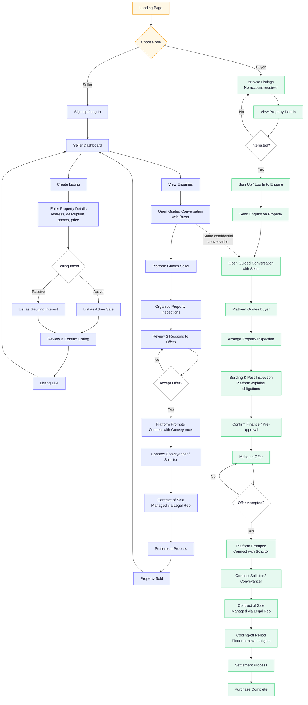

# Reasy — User Flow

```mermaid
flowchart TD
    %% ── Entry ──
    LANDING[Landing Page]
    LANDING --> ROLE{Choose role}
    ROLE -->|Seller| S_SIGNUP
    ROLE -->|Buyer| B_BROWSE

    %% ════════════════════════════════════════
    %% SELLER FLOW
    %% ════════════════════════════════════════

    S_SIGNUP[Sign Up / Log In]
    S_SIGNUP --> S_DASH[Seller Dashboard]

    %% ── Listing Creation ──
    S_DASH --> S_CREATE[Create Listing]
    S_CREATE --> S_DETAILS[Enter Property Details\nAddress, description, photos, price]
    S_DETAILS --> S_INTENT{Selling Intent}
    S_INTENT -->|Active| S_ACTIVE[List as Active Sale]
    S_INTENT -->|Passive| S_PASSIVE[List as Gauging Interest]
    S_ACTIVE --> S_REVIEW[Review & Confirm Listing]
    S_PASSIVE --> S_REVIEW
    S_REVIEW --> S_LIVE[Listing Live]
    S_LIVE --> S_DASH

    %% ── Managing Enquiries ──
    S_DASH --> S_ENQUIRIES[View Enquiries]
    S_ENQUIRIES --> S_CHAT[Open Guided Conversation\nwith Buyer]

    %% ── Guided Sale Process ──
    S_CHAT --> S_GUIDE[Platform Guides Seller]
    S_GUIDE --> S_INSPECTIONS[Organise Property Inspections]
    S_INSPECTIONS --> S_OFFERS[Review & Respond to Offers]
    S_OFFERS --> S_OFFER_DECISION{Accept Offer?}
    S_OFFER_DECISION -->|No| S_OFFERS
    S_OFFER_DECISION -->|Yes| S_LEGAL_PROMPT[Platform Prompts:\nConnect with Conveyancer]
    S_LEGAL_PROMPT --> S_LEGAL[Connect Conveyancer / Solicitor]

    %% ── Settlement ──
    S_LEGAL --> S_CONTRACT[Contract of Sale\nManaged via Legal Rep]
    S_CONTRACT --> S_SETTLEMENT[Settlement Process]
    S_SETTLEMENT --> S_SOLD[Property Sold]
    S_SOLD --> S_DASH

    %% ════════════════════════════════════════
    %% BUYER FLOW
    %% ════════════════════════════════════════

    B_BROWSE[Browse Listings\nNo account required]
    B_BROWSE --> B_VIEW[View Property Details]
    B_VIEW --> B_INTERESTED{Interested?}
    B_INTERESTED -->|No| B_BROWSE
    B_INTERESTED -->|Yes| B_SIGNUP[Sign Up / Log In to Enquire]
    B_SIGNUP --> B_ENQUIRE[Send Enquiry on Property]

    %% ── Guided Buy Process ──
    B_ENQUIRE --> B_CHAT[Open Guided Conversation\nwith Seller]
    B_CHAT --> B_GUIDE[Platform Guides Buyer]
    B_GUIDE --> B_INSPECT[Arrange Property Inspection]
    B_INSPECT --> B_BP[Building & Pest Inspection\nPlatform explains obligations]
    B_BP --> B_FINANCE[Confirm Finance / Pre-approval]
    B_FINANCE --> B_OFFER[Make an Offer]
    B_OFFER --> B_OFFER_RESULT{Offer Accepted?}
    B_OFFER_RESULT -->|No| B_OFFER
    B_OFFER_RESULT -->|Yes| B_LEGAL_PROMPT[Platform Prompts:\nConnect with Solicitor]
    B_LEGAL_PROMPT --> B_LEGAL[Connect Solicitor / Conveyancer]

    %% ── Settlement ──
    B_LEGAL --> B_CONTRACT[Contract of Sale\nManaged via Legal Rep]
    B_CONTRACT --> B_COOLING[Cooling-off Period\nPlatform explains rights]
    B_COOLING --> B_SETTLEMENT[Settlement Process]
    B_SETTLEMENT --> B_COMPLETE[Purchase Complete]

    %% ── Shared Conversation ──
    S_CHAT -.->|Same confidential\nconversation| B_CHAT

    %% ── Styling ──
    classDef seller fill:#e8edff,stroke:#605bff,color:#1a1a2e
    classDef buyer fill:#e6f9f0,stroke:#2ecc71,color:#1a1a2e
    classDef shared fill:#fff8e6,stroke:#f39c12,color:#1a1a2e
    classDef decision fill:#fff,stroke:#999,color:#1a1a2e

    class S_SIGNUP,S_DASH,S_CREATE,S_DETAILS,S_ACTIVE,S_PASSIVE,S_REVIEW,S_LIVE,S_ENQUIRIES,S_CHAT,S_GUIDE,S_INSPECTIONS,S_OFFERS,S_LEGAL_PROMPT,S_LEGAL,S_CONTRACT,S_SETTLEMENT,S_SOLD seller
    class B_BROWSE,B_VIEW,B_SIGNUP,B_ENQUIRE,B_CHAT,B_GUIDE,B_INSPECT,B_BP,B_FINANCE,B_OFFER,B_LEGAL_PROMPT,B_LEGAL,B_CONTRACT,B_COOLING,B_SETTLEMENT,B_COMPLETE buyer
    class LANDING,ROLE shared
    class S_INTENT,S_OFFER_DECISION,B_INTERESTED,B_OFFER_RESULT decision
```
